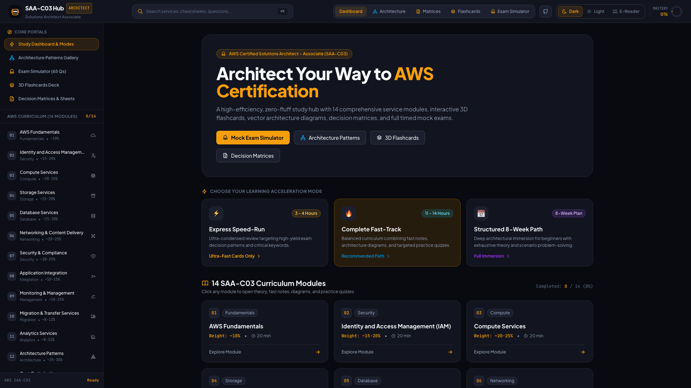

# AWS SAA-C03 Learning Hub

Interactive preparation platform for the AWS Certified Solutions Architect - Associate (SAA-C03) exam.

The hub includes 14 study modules, architecture diagrams, decision matrices, spaced-repetition flashcards, practice questions, a timed exam simulator, and offline progress tracking.

Website: https://aws-saa-c03.pilotworks.dev



## Quick Start

```bash
bun install
bun run dev
```

Build the static site with:

```bash
bun run build
```

## Documentation Overview

This directory contains all documentation organized by purpose.

## 📁 Directory Structure

### 📚 Study Guides (`study-guides/`)
Focused learning materials for exam preparation:
- **[FAST-LEARN-GUIDE.md](study-guides/FAST-LEARN-GUIDE.md)** - Complete fast-track guide (11-14 hrs)
- **[ULTRA-FAST-LEARNING-INDEX.md](study-guides/ULTRA-FAST-LEARNING-INDEX.md)** - Express learning path (3-4 hrs)
- **[QUICK-STUDY-NOTES.md](study-guides/QUICK-STUDY-NOTES.md)** - Condensed study notes
- **[STUDY-ROADMAP.md](study-guides/STUDY-ROADMAP.md)** - 8-week structured plan
- **[FLASHCARDS.md](study-guides/FLASHCARDS.md)** - Memorization aids

### 📖 Reference Materials (`reference/`)
Quick lookup guides and visual aids:
- **[QUICK-REFERENCE.md](reference/QUICK-REFERENCE.md)** - Quick facts and cheat sheets
- **[QUICK-START.md](reference/QUICK-START.md)** - Getting started guide
- **[DIAGRAMS-INDEX.md](reference/DIAGRAMS-INDEX.md)** - 100+ visual diagrams
- **[VISUAL-GUIDE.md](reference/VISUAL-GUIDE.md)** - Visual learning materials
- **[SAA-ARCHITECTURE-PATTERN-MASTER-SHEET.md](reference/SAA-ARCHITECTURE-PATTERN-MASTER-SHEET.md)** - Architecture patterns

> **Note:** For official AWS exam guides, please visit [AWS Certification](https://aws.amazon.com/certification/certified-solutions-architect-associate/).

### 📋 Project Documentation (`project-docs/`)
Repository and contribution information:
- **[CHANGELOG.md](project-docs/CHANGELOG.md)** - Version history
- **[CODE_OF_CONDUCT.md](project-docs/CODE_OF_CONDUCT.md)** - Community guidelines
- **[CONTRIBUTING.md](project-docs/CONTRIBUTING.md)** - How to contribute
- **[CONTRIBUTORS.md](project-docs/CONTRIBUTORS.md)** - Contributors list
- **[SECURITY.md](project-docs/SECURITY.md)** - Security policies

### 🎨 Web UI Specifications (`docs/ui-spec/`)
Technical blueprints for building the interactive web application:
- **[STATIC-GENERATION-SPEC.md](docs/ui-spec/STATIC-GENERATION-SPEC.md)** - React + Vite SSG, pre-rendering, structured data & performance blueprint
- **[UI-ARCHITECTURE-SPEC.md](docs/ui-spec/UI-ARCHITECTURE-SPEC.md)** - System architecture, routing & design system
- **[COMPONENT-SPEC.md](docs/ui-spec/COMPONENT-SPEC.md)** - Layout, tabs, quiz engine, 3D flashcards & diagram viewer
- **[DATA-CONTRACTS.md](docs/ui-spec/DATA-CONTRACTS.md)** - TypeScript interfaces & JSON data models
- **[PARSER-IMPLEMENTATION-GUIDE.md](docs/ui-spec/PARSER-IMPLEMENTATION-GUIDE.md)** - Regex parsers for questions, flashcards & Mermaid diagrams

## 🎯 Quick Navigation

### For Quick Learning
1. Start with [ULTRA-FAST-LEARNING-INDEX.md](study-guides/ULTRA-FAST-LEARNING-INDEX.md) (3-4 hrs)
2. Or use [FAST-LEARN-GUIDE.md](study-guides/FAST-LEARN-GUIDE.md) (11-14 hrs)
3. Reference [QUICK-REFERENCE.md](reference/QUICK-REFERENCE.md) for facts

### For Visual Learners
1. Browse [DIAGRAMS-INDEX.md](reference/DIAGRAMS-INDEX.md)
2. Check [VISUAL-GUIDE.md](reference/VISUAL-GUIDE.md)

### For Structured Study
1. Follow [STUDY-ROADMAP.md](study-guides/STUDY-ROADMAP.md)
2. Use [FLASHCARDS.md](study-guides/FLASHCARDS.md) for memorization
3. Review [PRACTICE-QUESTIONS.md](01-AWS-Fundamentals/PRACTICE-QUESTIONS.md) and the service-specific practice questions

### For Contributors
1. Read [CONTRIBUTING.md](project-docs/CONTRIBUTING.md)
2. Review [CODE_OF_CONDUCT.md](project-docs/CODE_OF_CONDUCT.md)
3. Check [CHANGELOG.md](project-docs/CHANGELOG.md)

## 📊 Exam Reviews

All practice test reviews are stored in the **[exam-reviews/](exam-reviews/)** directory.

## 📚 Content Attribution

Some documentation in this repository has been adapted and edited from [AWS Certified Solutions Architect - Associate (SAA-C03)](https://github.com/ChathurangaVKD/AWS-Certified-Solutions-Architect-Associate-SAA-C03).
