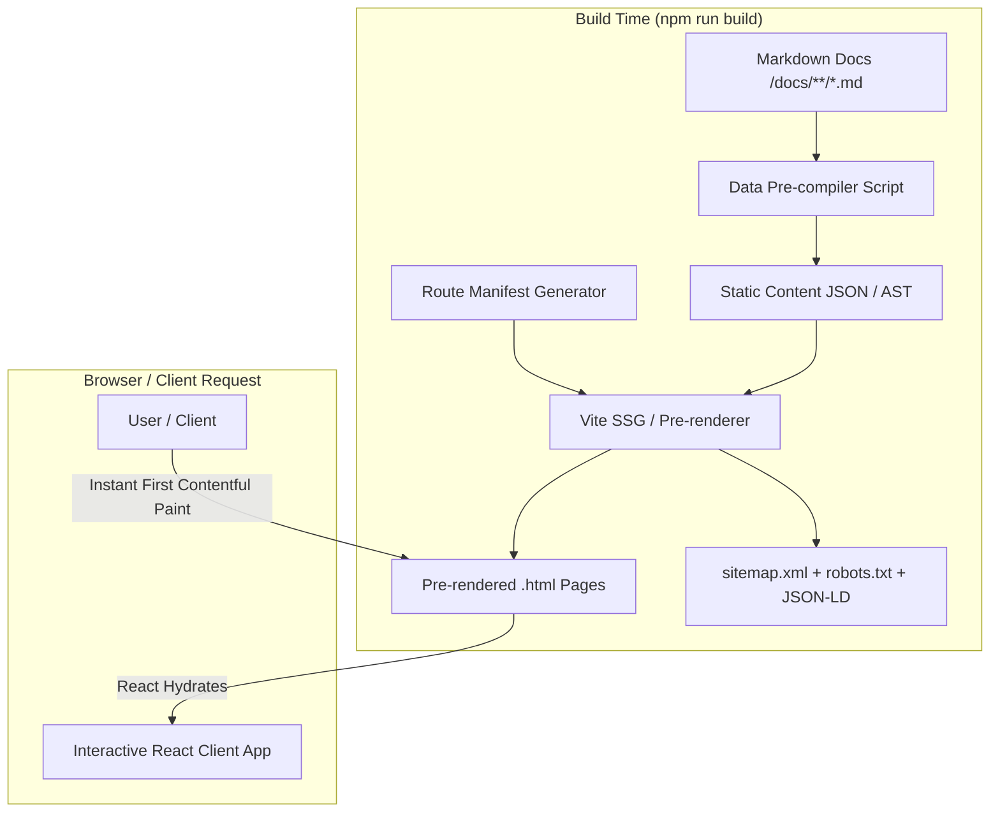

# 🚀 React + Vite Static Site Generation (SSG) & Performance Specification

> **Parent Spec**: [UI-ARCHITECTURE-SPEC.md](file:///Users/tienpham/Work/entj-pham/aws-learning/docs/ui-spec/UI-ARCHITECTURE-SPEC.md)  
> **Status**: Ready for Implementation  

---

## 🏗️ 1. Architecture Overview

To ensure instant page load speeds, maximum performance scores, and immediate availability of all documentation pages without server-side compute overhead, the platform uses **Static Site Generation (SSG) / Pre-rendering on top of React & Vite**.



---

## ⚙️ 2. Pre-rendering & Build Pipeline

### 2.1 Tooling Options
1. **`vike` (with `prerender: true`) or `vite-ssg`**:
   - Generates static HTML for all defined routes at compile time.
   - Outputs ready-to-deploy static files into `dist/`.
2. **Pre-build Content Aggregator (`scripts/build-content.ts`)**:
   - Runs before `vite build`.
   - Parses all 14 modules, practice questions, flashcards, and diagrams into optimized static chunks (`src/generated/`).
   - Computes reading times, word counts, and metadata.

### 2.2 Pre-rendered Route Manifest
Each of the following routes is emitted as a standalone `.html` file at build time:
* `/index.html` (Dashboard & Roadmaps)
* `/modules/index.html` (14 Modules Directory)
* `/modules/01-AWS-Fundamentals/index.html`
* `/modules/02-IAM/index.html`
* ...
* `/modules/14-Practice/index.html`
* `/exam-simulator/index.html`
* `/flashcards/index.html`
* `/cheatsheets/index.html`
* `/architecture/index.html`

---

## 🏷️ 3. Head & Metadata Management

Using `react-helmet-async` (or static `<head>` injection during SSG), each page generates unique metadata and link relationships:

```tsx
// Example: Head Metadata Component for Module Detail Page
import { Helmet } from 'react-helmet-async';

interface HeadProps {
  title: string;
  description: string;
  canonicalUrl: string;
  keywords: string[];
  ogImage?: string;
  schemaJson?: object;
}

export const PageHead: React.FC<HeadProps> = ({
  title,
  description,
  canonicalUrl,
  keywords,
  ogImage = 'https://your-domain.com/og-aws-hub.png',
  schemaJson,
}) => (
  <Helmet>
    {/* Standard Metadata */}
    <title>{`${title} | AWS Solutions Architect Associate (SAA-C03) Hub`}</title>
    <meta name="description" content={description} />
    <meta name="keywords" content={keywords.join(', ')} />
    <link rel="canonical" href={canonicalUrl} />
    <meta name="robots" content="index, follow" />

    {/* Open Graph / Social Previews */}
    <meta property="og:type" content="article" />
    <meta property="og:title" content={title} />
    <meta property="og:description" content={description} />
    <meta property="og:url" content={canonicalUrl} />
    <meta property="og:image" content={ogImage} />
    <meta property="og:site_name" content="AWS SAA-C03 Learning Hub" />

    {/* Twitter Card */}
    <meta name="twitter:card" content="summary_large_image" />
    <meta name="twitter:title" content={title} />
    <meta name="twitter:description" content={description} />
    <meta name="twitter:image" content={ogImage} />

    {/* Structured Data (JSON-LD) */}
    {schemaJson && (
      <script type="application/ld+json">
        {JSON.stringify(schemaJson)}
      </script>
    )}
  </Helmet>
);
```

---

## 📜 4. Structured Data (Schema.org JSON-LD)

Structured data is injected per page type for machine-readable information architecture:

### 4.1 Course & Exam Schema (`/` & `/modules`)
```json
{
  "@context": "https://schema.org",
  "@type": "Course",
  "name": "AWS Certified Solutions Architect - Associate (SAA-C03) Comprehensive Prep",
  "description": "Complete self-paced preparation course covering all 14 AWS SAA-C03 domains, architectural patterns, and practice exams.",
  "provider": {
    "@type": "Organization",
    "name": "AWS Learning Hub",
    "sameAs": "https://your-domain.com"
  },
  "educationalCredentialAwarded": "AWS Certified Solutions Architect - Associate",
  "hasCourseInstance": {
    "@type": "CourseInstance",
    "courseMode": "Online",
    "courseWorkload": "PT14H"
  }
}
```

### 4.2 Technical Article Schema (`/modules/:id`)
```json
{
  "@context": "https://schema.org",
  "@type": "TechArticle",
  "headline": "Module 06: VPC & Advanced AWS Networking Deep Dive",
  "description": "Master VPC subnets, Route Tables, NAT Gateways, Transit Gateway, and Hybrid Connectivity for AWS SAA-C03.",
  "articleSection": "Cloud Architecture",
  "keywords": "AWS VPC, CIDR, NAT Gateway, Transit Gateway, Route 53, SAA-C03",
  "inLanguage": "en"
}
```

### 4.3 Quiz / Practice Exam Schema (`/exam-simulator`)
```json
{
  "@context": "https://schema.org",
  "@type": "Quiz",
  "name": "AWS SAA-C03 Full Practice Exam Simulator",
  "description": "65-question timed mock exam testing High Availability, Security, Storage, and Cost Optimization.",
  "educationalLevel": "Intermediate",
  "about": {
    "@type": "Thing",
    "name": "AWS Solutions Architect Associate"
  }
}
```

---

## 🗺️ 5. Automated Sitemap & Robots Generation

Build script automatically traverses all generated routes and creates standard index files:

### `public/robots.txt`
```text
User-agent: *
Allow: /
Sitemap: https://your-domain.com/sitemap.xml
```

### Build-time Sitemap Generator (`scripts/generate-sitemap.ts`)
```typescript
import fs from 'fs';

export function generateSitemap(routes: string[], domain: string) {
  const xml = `<?xml version="1.0" encoding="UTF-8"?>
<urlset xmlns="http://www.sitemaps.org/schemas/sitemap/0.9">
  ${routes
    .map(
      route => `
  <url>
    <loc>${domain}${route}</loc>
    <lastmod>${new Date().toISOString().split('T')[0]}</lastmod>
    <changefreq>${route.startsWith('/modules') ? 'weekly' : 'monthly'}</changefreq>
    <priority>${route === '/' ? '1.0' : route.startsWith('/modules') ? '0.8' : '0.6'}</priority>
  </url>`
    )
    .join('')}
</urlset>`;

  fs.writeFileSync('dist/sitemap.xml', xml);
}
```

---

## ⚡ 6. Performance & Core Web Vitals Strategy

1. **Zero Layout Shifts (CLS = 0)**:
   - Fixed aspect ratios for all architecture diagrams and card placeholders.
   - System font fallback stack with matching font metrics before web fonts load.
2. **Lightning Fast First Contentful Paint (FCP < 0.8s)**:
   - Critical CSS inlined directly into `<head>` of pre-rendered HTML.
   - Async loading for heavy visualization scripts (Mermaid.js loaded on-demand only when Diagrams tab is active).
3. **Semantic HTML5 & Accessibility**:
   - Single `<h1>` tag per page.
   - Standard semantic landmark tags (`<header>`, `<nav>`, `<main>`, `<article>`, `<aside>`, `<footer>`).
   - Accessible ARIA labels on all interactive quiz triggers and flashcards.
